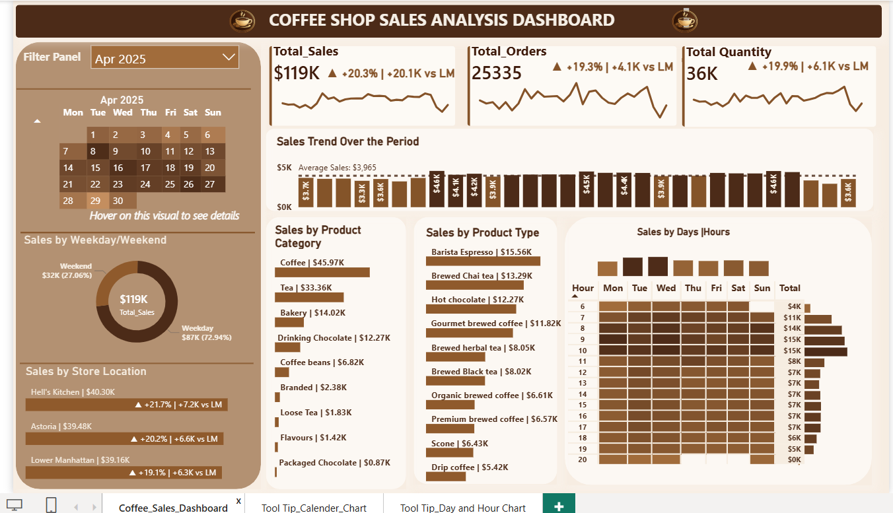

# ☕ Coffee Shop Sales Analysis Project
This project analyzes coffee shop sales data to uncover key business insights, track performance metrics, and support data-driven decision-making across products, stores, and customer behavior.
---

## 📌 Table of Contents

- [📊 Project Overview](#-project-overview)
- [🎯 Problem Statement & Business Objective](#-problem-statement--business-objective)
- [📌 Business Objectives](#-business-objectives)
- [🗂️ Dataset Overview](#-dataset-overview)
- [🧹 Data Preparation & Modeling](#-data-preparation--modeling)
- [🛠️ Tools & Technologies Used](#-tools--technologies-used)
- [📦 KPI Summary](#-kpi-summary)
- [📅 Month Filter](#-month-filter)
- [🔥 Calendar Heatmap](#-calendar-heatmap)
- [📊 Weekday vs Weekend Analysis](#-weekday-vs-weekend-analysis)
- [🏪 Store Location Performance](#-store-location-performance)
- [☕ Product Category Analysis](#-product-category-analysis)
- [🥇 Product Type Performance](#-product-type-performance)
- [📈 Daily Sales Trend Analysis](#-daily-sales-trend-analysis)
- [⏰ Sales by Hours & Days Heatmap](#-sales-by-hours--days-heatmap)
- [🚀 Recommendations](#-recommendations)
- [💼 Business Impact](#-business-impact)
- [📊 Dashboard Preview](#-dashboard-preview)
- [▶️ How to Run This Project](#-how-to-run-this-project)
- [👩‍💻 Author](#-author)

---

# 📊 Project Overview

This project showcases an **interactive Power BI dashboard** built to analyze and monitor coffee shop sales performance using transactional data.

The project transforms raw data into actionable insights, supporting data-driven decisions across sales, product strategy, and store performance.

It provides clear visibility into:
- Key business metrics  
- Sales trends  
- Customer purchasing behavior  
- Top-performing products  
- Store-level performance  

Designed with a **premium brown and beige coffee-inspired theme**, the report delivers a clean, modern, and executive-friendly analytical experience.

---

# 🎯 Problem Statement & Business Objective

Coffee shop businesses generate large volumes of transactional data across multiple stores, products, and customer orders. Without a centralized reporting system, tracking business performance and identifying growth opportunities becomes challenging.

This project focused on :
- Transforming raw sales data into actionable insights  
- Supporting data-driven decision-making  
- Improving business visibility and reporting efficiency  

---

# 📌 Business Objectives

- Track key KPIs such as Total Sales, Orders, and Quantity Sold  
- Analyze sales trends and Month-over-Month (MoM) growth  
- Compare weekday vs weekend sales performance  
- Evaluate store location performance  
- Identify top-performing products and categories  
- Analyze customer purchasing patterns and peak sales hours  
- Enable interactive and centralized business reporting  

---

# 🗂️ Dataset Overview

The dataset contains **149,000+ transactional records** stored in a single fact table. A separate Date Table was created for time-based analysis.

### 📁 Transactional Data
- Transaction ID  
- Transaction Date  
- Transaction Time  
- Transaction Quantity  
- Unit Price  

### 📁 Store Information
- Store ID  
- Store Location  

### 📁 Product Information
- Product ID  
- Product Category  
- Product Type  
- Product Detail  

---

# 🧹 Data Preparation & Modeling

- Cleaned and transformed raw data using Power Query  
- Corrected data types and inconsistencies  
- Built relationships between tables  
- Created calculated columns and DAX measures  
- Implemented Month-over-Month (MoM) calculations  
- Validated results using SQL queries  

---

# 🛠️ Tools & Technologies Used

- 📊 Power BI Desktop  
- 🔄 Power Query  
- 📐 DAX (Data Analysis Expressions)  
- 🗄️ Microsoft SQL Server  
- 🧠 Data Modeling  
- ✅ SQL for validation  

---

# 📦 KPI Summary

Dashboard insights are based on **April 2025 performance**.

### 💰 Key Metrics:
- **Total Sales:** $119K  
- **Total Orders:** 25,335  
- **Total Quantity Sold:** 36K  

### 📈 Insights:
- All KPIs show positive Month-over-Month (MoM) growth  
- April performance improved compared to previous month  

---

# 📅 Month Filter

An interactive Month Filter allows dynamic filtering of all visuals and KPIs based on selected time period.

---

# 🔥 Calendar Heatmap
The Calendar Heatmap visual highlights daily sales performance for the selected month using color intensity:

- Darker shades represent higher sales
- Lighter shades represent lower sales

### Features:
- Clickable dates for drill-down analysis  
- Tooltip shows:
  - Total Sales  
  - Total Orders  
  - Total Quantity Sold  

---

# 📊 Weekday vs Weekend Analysis
A donut chart compares sales contribution between weekdays and weekends to understand customer purchasing patterns across different days of the week.
- Weekdays contribute ~73% of sales  
- Weekends contribute ~27% of sales  

### 💡 Business Value:
- Helps optimize staffing  
- Improves inventory planning  
- Supports promotional strategy  

Users can interact with the chart to dynamically filter and analyze dashboard performance for weekdays and weekends.
---

# 🏪 Store Location Performance

This analysis supports branch-level performance monitoring, regional strategy planning, and operational decision-making.
### Locations:
- Hell’s Kitchen  
- Astoria  
- Lower Manhattan  

### 📌 Key Insight:
- Hell’s Kitchen is the top-performing store  
- All stores show positive MoM growth  

Users can interact with the store location bar chart to dynamically analyze and compare performance across different stores throughout the dashboard.
---

# ☕ Product Category Analysis
This analysis helps identify high-performing product categories, enabling better inventory planning, category-focused promotions, and data-driven product strategy decisions.
### Top Categories:
- Coffee  
- Tea  
- Bakery  
- Drinking Chocolate  
- Coffee Beans  

### 📌 Key Insights:
- Coffee contributes ~39% of total revenue  
- Tea and Bakery are strong secondary drivers  

---

# 🥇 Product Type Performance
This visual provides product-level sales analysis to identify the top-performing 10 beverages and menu items.
### Top Products:
- Barista Espresso  
- Brewed Chai Tea  
- Hot Chocolate  
- Gourmet Brewed Coffee  

### 📌 Insight:
Barista Espresso is the highest-selling product. Tea and chocolate-based drinks also showed high demand, supporting data-driven decisions for menu optimization, inventory planning, and targeted promotional campaigns.

---

# 📈 Daily Sales Trend Analysis
The Daily Sales Trend chart compares daily sales performance against the average sales benchmark for the selected month.
-  Darker = Above average sales  
-  Lighter = Below average sales  

### 📌 Insight:
Sales were lower during the first week of the month, then stabilized for the remainder of the period, with occasional spikes highlighting peak demand and high-performing sales days.

---

# ⏰ Sales by Hours & Days Heatmap
 The Hours Heatmap visual shows sales performance across hours and weekdays for the selected month, where darker shades indicate higher sales and lighter shades indicate lower activity. The top section highlights overall weekday performance, making it easy to identify peak and low-demand days. A custom tooltip displays Total Sales, Orders, and Quantity Sold for each hour-day combination.
 
### 📌 Key Insight:
- Peak hours: **7 AM – 10 AM**  
- Peak days: **Tuesday & Wednesday**

### 💡 Business Value:
- Better workforce planning  
- Efficient inventory management  
- Peak-hour optimization  

---

# 🚀 Recommendations

- Increase staffing during peak hours (7–10 AM)  
- Focus marketing on Coffee, Tea, Bakery  
- Introduce weekend promotions  
- Replicate strategies from top-performing stores (Hells's Kitchen) 
- Optimize inventory using demand trends  

---

# 💼 Business Impact

- Centralized reporting system  
- Faster decision-making  
- Improved operational efficiency  
- Better inventory & workforce planning  
- Increased revenue insights and visibility  

--- 
# 📊 Dashboard Preview

---

# ▶️ How to Run This Project

1. Download project files from GitHub  
2. Open the `.pbix` file in Power BI Desktop  
3. Go to **Transform Data → Data Source Settings**  
4. Change source path to dataset folder  
5. Click **Close & Apply**  
6. Click **Refresh**  

### (Optional SQL Validation)
- Create database using provided SQL scripts   
- Run validation queries to verify accuracy  

---

# 👩‍💻 Author

**Sapna Devi**  
**sapnadevi9991@gmail.com**
